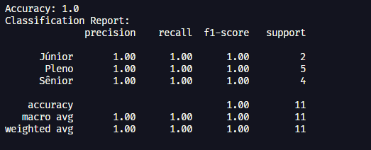
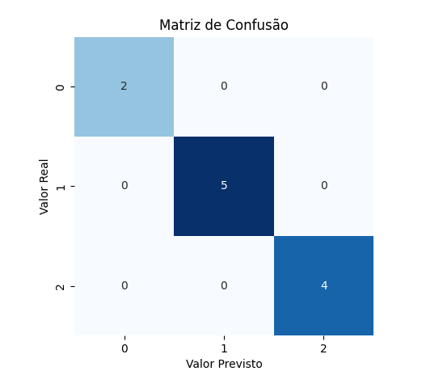

    

# Trabalho Final - Implementação de Algoritmos de Machine Learning

## Descrição do Projeto

Este projeto implementa Machine Learning para resolver um problema real. Criamos o Talent Rank para ajudar usuários que já estão ingressados na área da Tecnologia da Informação, para que possam descobrir ou aperfeiçoar seu posicionamento profissional. Através de perguntas formuladas por uma pesquisa aprofundada, facilitando os usuários a procurararem por uma vaga na qual suas habilidades se encaixam, ou para ajudar empresas que procuram funcionários qualificados para o cargo específico.

## Documentação

- RELATÓRIO -> [MACHINE LEARNING](./docs/Algoritmo%20Genético.pdf)

## Funcionalidades

### Classificação de Desenvolvedores

- Avalia o nível do desenvolvedor (Junior, Pleno ou Senior)

### Aprendizado Contínuo

- O sistema aprende com cada nova classificação
- Recebe um conjunto de respostas do usuário (um vetor com 40 respostas)

### Análise de Desempenho

- Mostra gráfico de evolução da acurácia ao longo do tempo
- Exibe matriz de confusão para análise de erros

## Testes e Resultados

Por ser uma base de dados simples, não teve muita diferença na realização dos testes com os dois algoritmos de classificação.

### Gráficos das Evoluções

#### **Acurácia**

#### **Resultado e Sugestões**

### **Matrix de Confusão**

## Conclusão

---

### Trabalho desenvolvido por:

**Grupo**:

- [Beatriz Alves](https://www.linkedin.com/in/beatriz-alves-de-souza-789a84239/)
- [Luana Aguilar](https://www.linkedin.com/in/luana-aguilar-bb65b7258/)
- [Lucelho Silva](https://www.linkedin.com/in/lucelhosilva/)
- [Renato Noronha](https://www.linkedin.com/in/renatonoronha/)
- [Túlio Inácio](https://www.linkedin.com/in/t%C3%BAlio-in%C3%A1cio-767244276/)

Data: **06 de dezembro de 2024**

## Docente do Projeto

Glender Brás | [Linkedin](https://www.linkedin.com/in/glenderbras/)
