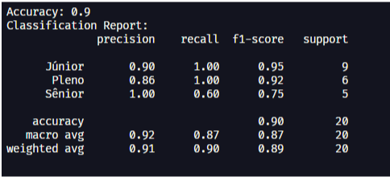

    

# Trabalho Final - Implementação de Algoritmos de Machine Learning

## Descrição do Projeto

Este projeto implementa Machine Learning para resolver um problema real. Criamos o Talent Rank para ajudar usuários que já estão ingressados na área da Tecnologia da Informação, para que possam descobrir ou aperfeiçoar seu posicionamento profissional. Através de perguntas formuladas por uma pesquisa aprofundada, facilitando os usuários a procurararem por uma vaga na qual suas habilidades se encaixam.

## Documentação

- RELATÓRIO -> [MACHINE LEARNING](./docs/Relatório%20Talent%20Rank.pdf)

## Funcionalidades

### Classificação de Desenvolvedores

- Avalia o nível do desenvolvedor (Junior, Pleno ou Senior)

### Aprendizado Contínuo

- O sistema aprende com cada nova classificação
- Recebe um conjunto de respostas do usuário (um vetor com 40 respostas)

### Análise de Desempenho

- Mostra gráfico de evolução da acurácia ao longo do tempo
- Exibe matriz de confusão para análise de erros

## Testes e Resultados

Fizemos dois testes diferentes, alterando o tamanho da Base de Dados e algumas métricas dos Algoritmos de Classificação.

### Gráficos das Evoluções

#### **Acurácia Árvore de Decisão**

#### **Matrix de Confusão - Árvore de Decisão**

#### **Acurácia KNN**

#### **Matrix de Confusão - KNN**

### **Resultado e Sugestões**

## Conclusão

Analisando os resultados de ambos, a Árvore de Decisão alcançou uma acurácia maior com menos exemplos de usuários do que o KNN. O KNN, por sua vez, precisou de uma banco de dados com mais de 200 exemplos de usuários para que alcançasse a acurácia de 100%.

Observou-se que, com o algoritmo de Árvore de Decisão para classificar diferentes usuários com seus respectivos níveis, obteve melhores resultados, procurando um melhor “Nó” ou Folha para encontrar o melhor caminho de solução.

### Trabalho desenvolvido por:

**Grupo**:

- [Beatriz Alves](https://www.linkedin.com/in/beatriz-alves-de-souza-789a84239/)
- [Luana Aguilar](https://www.linkedin.com/in/luana-aguilar-bb65b7258/)
- [Lucelho Silva](https://www.linkedin.com/in/lucelhosilva/)
- [Renato Noronha](https://www.linkedin.com/in/renatonoronha/)
- [Túlio Inácio](https://www.linkedin.com/in/t%C3%BAlio-in%C3%A1cio-767244276/)

Data: **06 de dezembro de 2024**

## Docente do Projeto

Glender Brás | [Linkedin](https://www.linkedin.com/in/glenderbras/)
